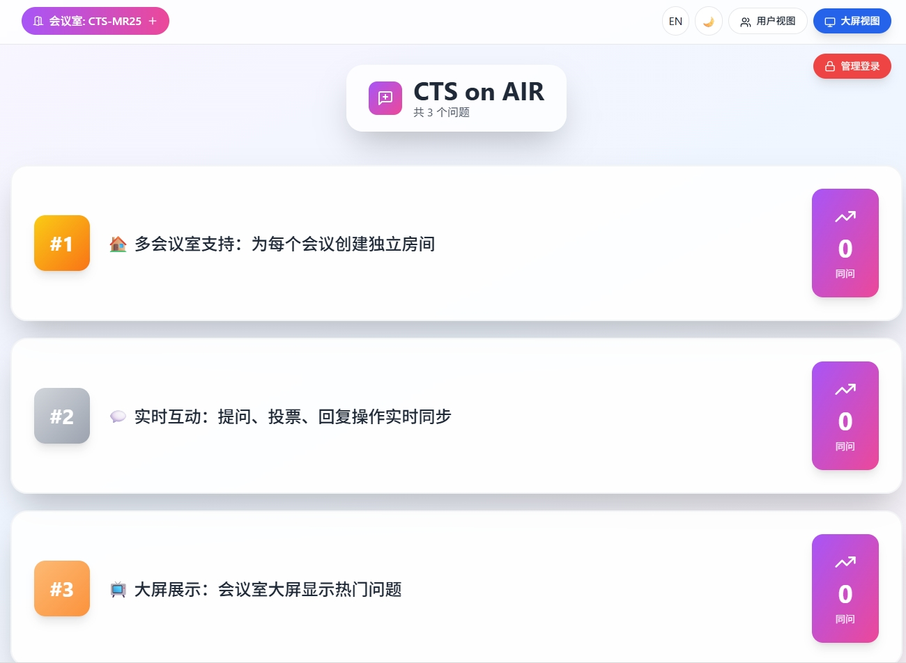
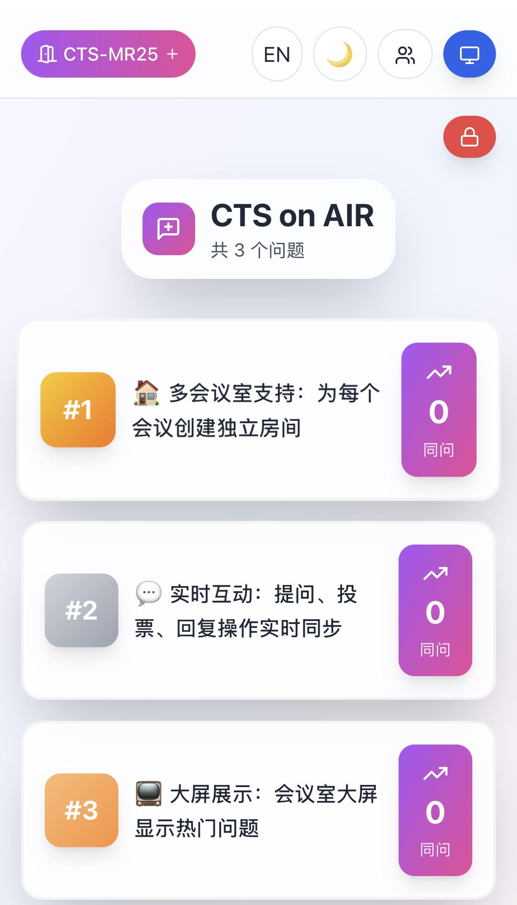

# Anonymous Q&A Platform / 会议匿名问答平台

[English](README.en.md) | [中文](#chinese)


---

<a name="chinese"></a>
## 🇨🇳 中文

### 📸 应用截图

**大屏视图:**



*大屏模式显示热门问题及实时投票*

**用户视图 (手机/电脑):**



---

### 🎯 项目概述

**anonymous-qa** 是一个基于 Next.js 和 Firebase 实时数据库的匿名问答平台。设计用于会议、演讲等场景，支持观众匿名提问、实时同问投票，并提供大屏展示界面。

### ✨ 核心功能

- **多会议室支持**：通过 URL 参数动态切换会议室（`?room=房间名`）
- **双视图架构**：用户视图（提问端）+ 大屏视图（展示端）
- **实时同步**：基于 Firebase Realtime Database 的实时数据同步
- **防重复投票**：使用设备 ID 机制防止同一设备多次投票
- **交互式回复**：用户可以对问题进行回复和讨论
- **用户自行删除**：用户可以删除自己提交的问题（带二次确认和速率限制）
- **速率限制**：客户端防滥用机制（提问、投票、回复、创建会议室、用户删除）
- **管理功能**：密码保护的管理模式，支持删除问题、清空所有问题、清理闲置会议室
- **会议室管理**：最近访问历史、一键创建/切换会议室、复制房间链接
- **主题切换**：白天/黑夜模式，设置持久化到 localStorage
- **国际化支持**：中英文双语界面，语言设置持久化到 localStorage
- **响应式设计**：完整支持手机、平板、桌面和大屏显示

### 🚀 快速开始

#### 环境要求

- 已安装 Node.js 14+
- Firebase 账号
- Vercel 账号（可选，用于部署）

#### 安装步骤

```bash
# 克隆仓库
git clone https://github.com/yourusername/anonymous-qa.git
cd anonymous-qa

# 安装依赖
npm install

# 创建环境变量文件
cp .env.local.example .env.local
# 编辑 .env.local 填入你的 Firebase 配置

# 启动开发服务器
npm run dev
```

访问 http://localhost:3000

### 📦 技术栈

- **前端框架**: Next.js 14, React 18, Tailwind CSS, Framer Motion
- **后端服务**: Firebase Realtime Database
- **部署平台**: Vercel（推荐）
- **图标库**: Lucide React

### 🔥 Firebase 配置指南

#### 第一步：创建 Firebase 项目

1. 访问 https://console.firebase.google.com/
2. 点击"添加项目"
3. 输入项目名称（如：anonymous-qa）
4. 创建项目

#### 第二步：启用实时数据库

1. 左侧菜单选择"构建" > "Realtime Database"
2. 点击"创建数据库"
3. 选择位置：`asia-southeast1`（新加坡）推荐
4. 以**测试模式**启动

#### 第三步：配置安全规则

进入"规则"标签页，粘贴以下内容:

```json
{
  "rules": {
    "rooms": {
      "$roomId": {
        ".read": true,
        ".write": true,
        "questions": {
          ".read": true,
          ".write": true,
          "$questionId": {
            ".validate": "newData.hasChildren(['text', 'votes', 'timestamp'])"
          }
        }
      }
    }
  }
}
```

点击"发布"

#### 第四步：获取配置信息

1. 进入项目设置 > 常规
2. 滚动到"您的应用"部分
3. 点击 Web 图标（</>）
4. 复制 `firebaseConfig` 对象

#### 第五步：配置环境变量

在项目根目录创建 `.env.local` 文件:

```bash
NEXT_PUBLIC_FIREBASE_API_KEY=你的_API_KEY
NEXT_PUBLIC_FIREBASE_AUTH_DOMAIN=你的项目.firebaseapp.com
NEXT_PUBLIC_FIREBASE_DATABASE_URL=https://你的项目-default-rtdb.asia-southeast1.firebasedatabase.app
NEXT_PUBLIC_FIREBASE_PROJECT_ID=你的项目ID
NEXT_PUBLIC_FIREBASE_STORAGE_BUCKET=你的项目.appspot.com
NEXT_PUBLIC_FIREBASE_MESSAGING_SENDER_ID=你的SENDER_ID
NEXT_PUBLIC_FIREBASE_APP_ID=你的APP_ID
NEXT_PUBLIC_ADMIN_PASSWORD=你的管理员密码123
```

### 🌐 部署到 Vercel

#### Vercel 部署（推荐）

1. 将代码推送到 GitHub
2. 在 Vercel Dashboard 导入项目
3. 在 Vercel Settings 中添加环境变量
4. 自动部署完成

### 📖 项目文档

- [CLAUDE.md](CLAUDE.md) - 完整开发指南

### 🆘 常见问题

**Q: 提交问题后没有显示？**
A: 检查浏览器控制台错误，确认 Firebase 配置正确

**Q: 显示 "Permission denied"？**
A: 检查 Firebase 安全规则是否正确配置

**Q: Vercel 部署失败？**
A: 确认所有环境变量都已在 Vercel 中配置

**Q: 本地运行但 Vercel 不行？**
A: 检查环境变量名称是否完全一致（包括 NEXT_PUBLIC_ 前缀）

### 🤝 贡献

欢迎贡献!请随时提交 Pull Request。

### 📄 授权许可

本项目在 **[MIT License](LICENSE)** 许可下完全开源，您可以自由地在任何个人或商业项目中使用。

### ☕ 支持项目

如果这个项目对你有帮助，请考虑**请我喝杯咖啡** ☕️！

<a href="https://buymeacoffee.com/suweihongc">
  
</a>

或通过微信/支付宝赞赏:


非常感谢每一位支持者！

---

Made with ❤️ by goldenhawksu
